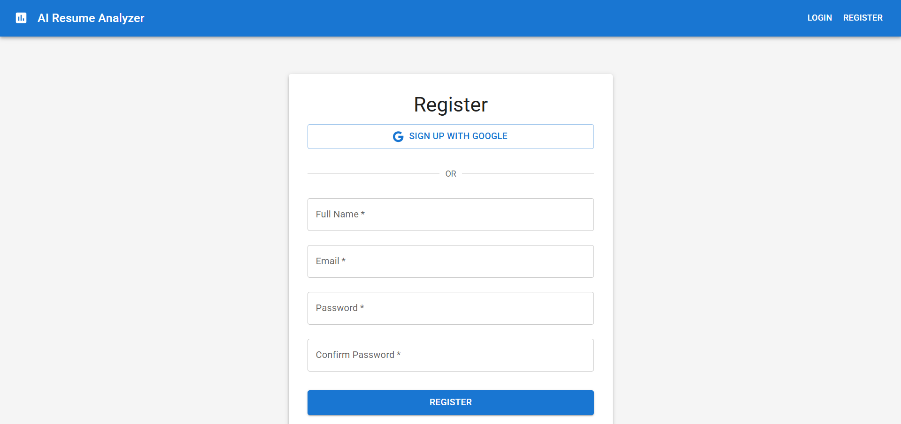
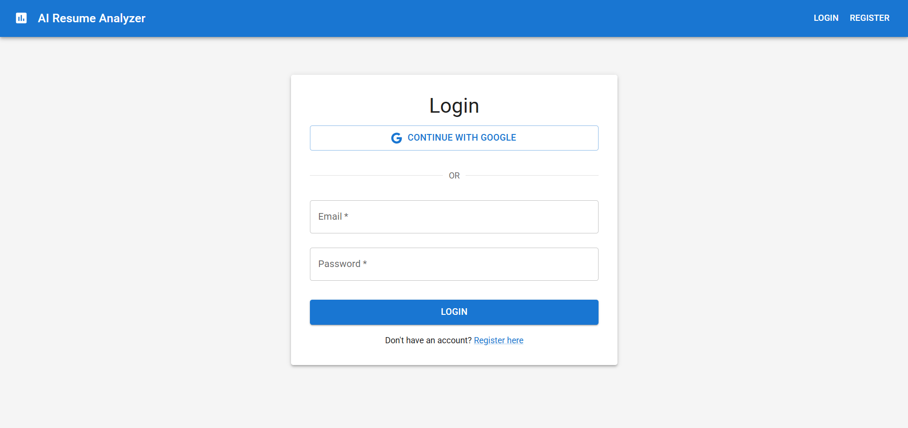
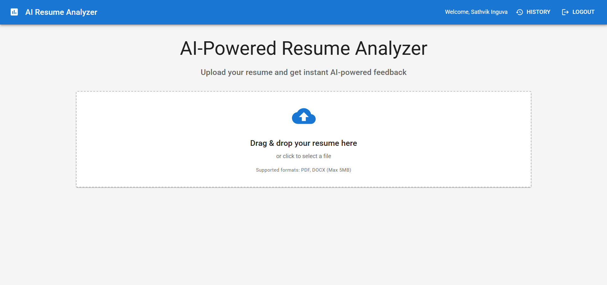
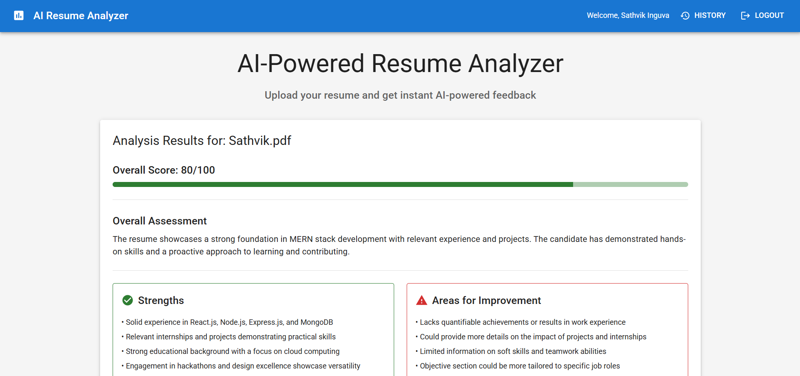
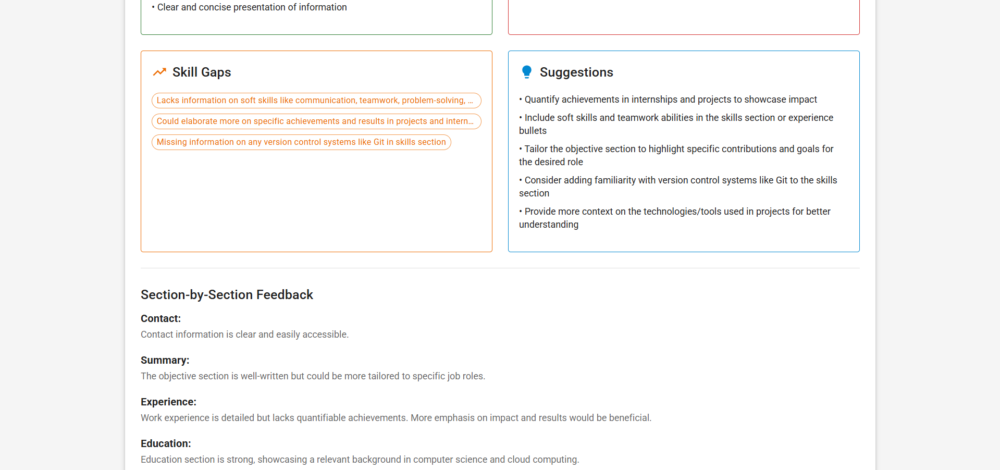
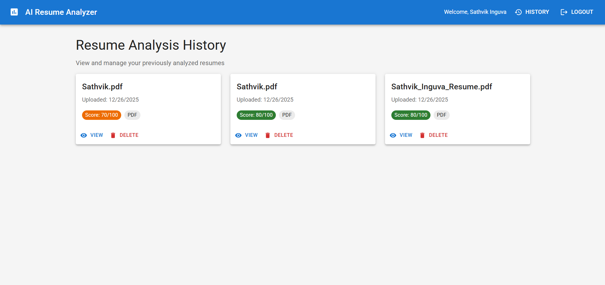
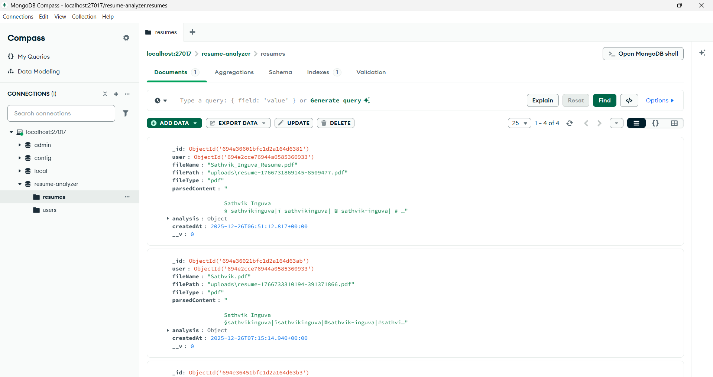
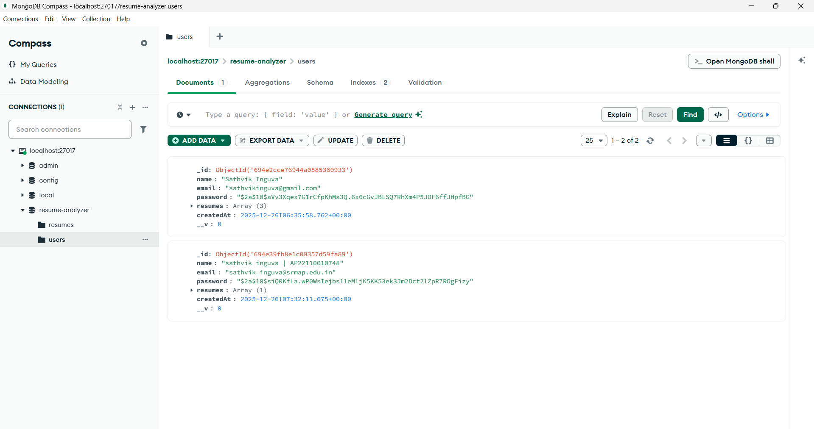

# AI-Powered Resume Analyzer

An intelligent resume analysis tool that leverages OpenAI's GPT to provide comprehensive feedback on resumes, identify skill gaps, and suggest improvements.

## Features

- Upload resumes in PDF or DOCX format
- AI-powered resume analysis using OpenAI GPT
- Secure authentication with JWT and Google OAuth
- Skill gap identification and improvement suggestions
- Detailed feedback on resume sections
- Responsive Material-UI interface
- MongoDB storage for resumes and feedback
- Resume history tracking

## Tech Stack

### Frontend
- React.js with Vite
- Redux Toolkit for state management
- Material-UI for components
- React Router for navigation
- Axios for API calls
- Google OAuth 2.0 integration

### Backend
- Node.js
- Express.js
- Multer for file uploads
- pdf-parse for PDF parsing
- mammoth for DOCX parsing
- OpenAI API integration
- Google Auth Library for OAuth
- JWT for authentication

### Database
- MongoDB
- Mongoose ODM

## Prerequisites
- Google OAuth 2.0 credentials (for Google Sign-In)

- Node.js (v16 or higher)
- MongoDB (local or Atlas)
- OpenAI API key

## Installation

### 1. Clone the repository
```bash
git clone <repository-url>
```

### 2. Backend Setup
```bash
cd backend
npm install
```

Create a `.env` file in the backend directory:
```env
PORT=5000
MONGODB_URI=mongodb://localhost:27017/resume-analyzer
OPENAI_API_KEY=your_openai_api_key
JWT_SECRET=jwt_secret_key
GOOGLE_CLIENT_ID=your_google_client_id
NODE_ENV=development
```

### 3. Frontend Setup
```bash
cd frontend
npm install
```

Create a `.env` file in the frontend directory:
```env
VITE_API_URL=http://localhost:5000/api
VITE_GOOGLE_CLIENT_ID=your_google_client_id
```

### 4. Google OAuth Setup (Optional but Recommended)

To enable Google Sign-In:

1. Go to [Google Cloud Console](https://console.cloud.google.com/)
2. Create a new project or select existing one
3. Enable Google+ API
4. Go to "Credentials" → "Create Credentials" → "OAuth 2.0 Client ID"
5. Configure OAuth consent screen
6. Add authorized JavaScript origins:
   - `http://localhost:5173` (development)
   - Your production URL
7. Add authorized redirect URIs:
   - `http://localhost:5173`
   - Your production URL
8. Copy the Client ID and add it to both `.env` files

**Note:** If you skip Google OAuth setup, users can still register/login with email and password.

## Running the Application

```bash
# Start Backend Server
cd backend
npm run dev

# Start Frontend Development Server (in a new terminal)
cd frontend
npm run dev
```

The application will be available at `http://localhost:5173`

## Screenshots

### 1. Register Page

User registration with email/password or Google Sign-In option.

### 2. Login Page

User login with email/password or Google OAuth authentication.

### 3. Home Page

Upload interface with drag-and-drop functionality for PDF/DOCX resumes.

### 4. Analysis Page



Comprehensive AI-generated resume analysis with scores, strengths, weaknesses, and suggestions.

### 5. History Page

View all previously analyzed resumes with scores and quick actions.

### 6. Resumes Data (MongoDB Collection)

Backend MongoDB collection storing resume files and analysis results.

### 7. Users Data (MongoDB Collection)

Backend MongoDB collection storing user authentication and profile data.

## Project Structure

```
Resume Analyzer/
├── backend/
│   ├── config/
│   ├── controllers/
│   ├── middleware/
│   ├── models/
│   ├── routes/
│   ├── services/
│   ├── tests/
│   └── server.js
├── frontend/
│   ├── public/
│   ├── src/
│   │   ├── components/
│   │   ├── pages/
│   │   ├── redux/
│   │   ├── services/
│   │   └── App.jsx
│   └── index.html
└── README.md
```

## Acknowledgments

- OpenAI for GPT API
- Google for OAuth 2.0
2. Create your feature branch (`git checkout -b feature/AmazingFeature`)
3. Commit your changes (`git commit -m 'Add some AmazingFeature'`)
4. Push to the branch (`git push origin feature/AmazingFeature`)
5. Open a Pull Request

## Acknowledgments

- OpenAI for GPT API
- Material-UI team
- React and Node.js communities
